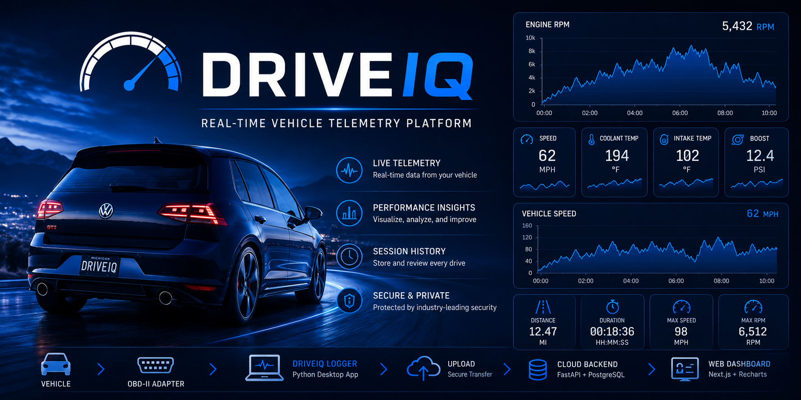
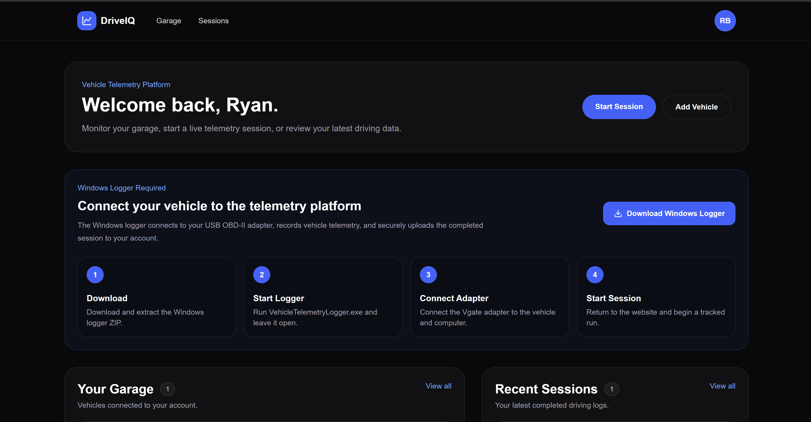
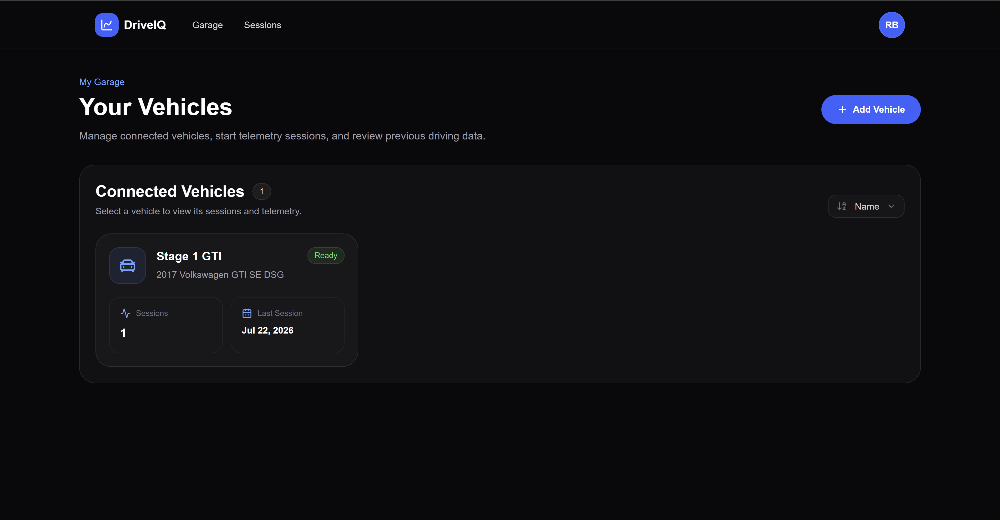
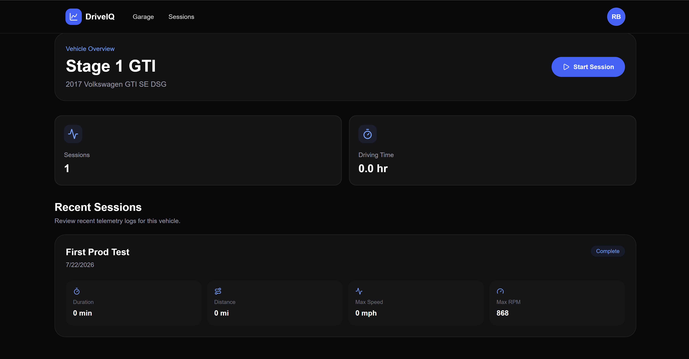
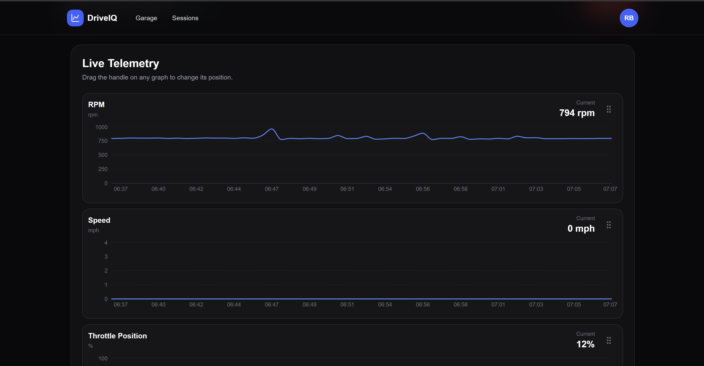
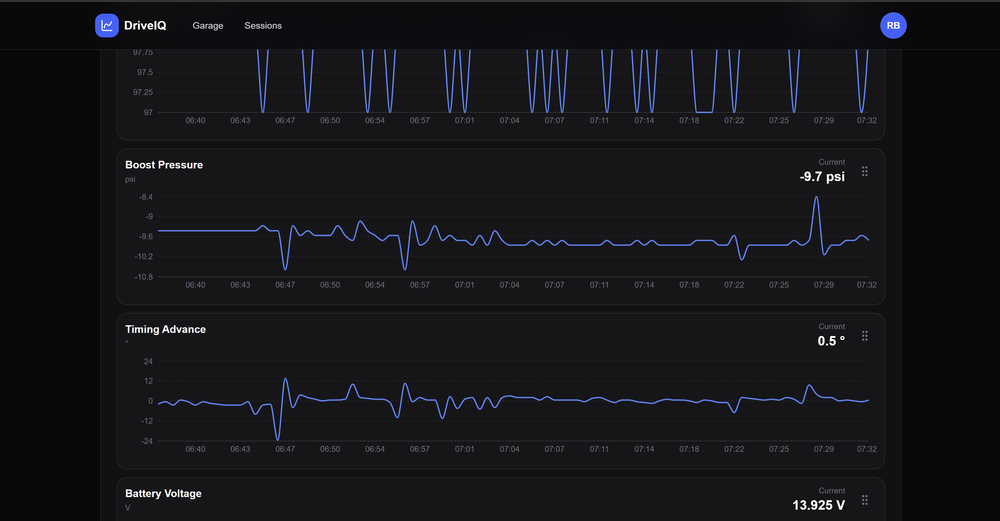
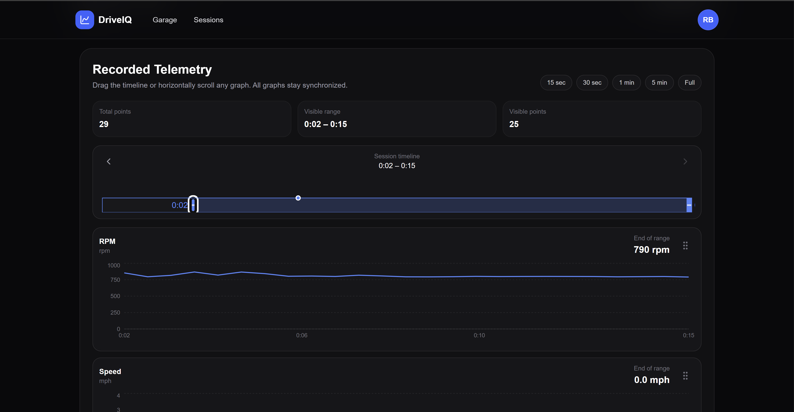

# DriveIQ

A full-stack vehicle telemetry platform that records real-time OBD-II data, streams live vehicle metrics, and stores completed driving sessions for later analysis.



---

## Features

* Live telemetry dashboard
* Real-time vehicle metrics
* Automatic driving session recording
* Historical session playback
* Interactive telemetry charts
* Vehicle garage management
* CSV session export
* Secure authentication with Clerk
* Windows desktop logger
* Production deployment

---

## How It Works

1. Launch the **DriveIQ Logger**.
2. Connect a supported OBD-II adapter to your vehicle.
3. Sign in to DriveIQ.
4. Select a vehicle from your garage.
5. Start a driving session.
6. View live telemetry while driving.
7. End the session.
8. The logger automatically uploads the completed CSV.
9. Review historical data through interactive charts.

---

## Screenshots

### Dashboard



### Garage



### Vehicle Page



### Live Session




### Historical Session



---

## System Architecture

```text
Vehicle
    │
    ▼
USB OBD-II Adapter
    │
    ▼
DriveIQ Logger (Python)
    │
    ▼
FastAPI Backend
    │
    ▼
PostgreSQL Database
    │
    ▼
Next.js Frontend
```

---

## Tech Stack

### Frontend

* Next.js (App Router)
* React
* TypeScript
* Tailwind CSS
* Clerk Authentication
* Recharts

### Backend

* FastAPI
* SQLAlchemy
* PostgreSQL (Neon)
* Alembic

### Desktop Logger

* Python
* python-obd
* FastAPI
* PyInstaller

### Deployment

* Vercel
* Neon PostgreSQL
* GitHub Releases

---

## Project Structure

```text
frontend/
backend/
logger/
assets/
```

---

## Running Locally

### Frontend

```bash
npm install
npm run dev
```

### Backend

```bash
cd backend
pip install -r requirements.txt
uvicorn app.app:app --reload
```

### Logger

```bash
cd logger
pip install -r requirements.txt
python main.py
```

---

## Windows Logger

The Windows logger is distributed separately through the GitHub Releases page.

After downloading and extracting the logger:

1. Connect a supported USB OBD-II adapter.
2. Launch `VehicleTelemetryLogger.exe`.
3. Open DriveIQ.
4. Start a driving session.

The logger automatically records telemetry and uploads completed sessions to the production backend.

---

## Future Improvements

* Bluetooth OBD-II adapter support
* Additional telemetry metrics
* GPS route visualization
* Session comparison tools
* Vehicle sharing
* Mobile companion application
* Diagnostic Trouble Code (DTC) viewer
* Performance analytics

---

## License

MIT
